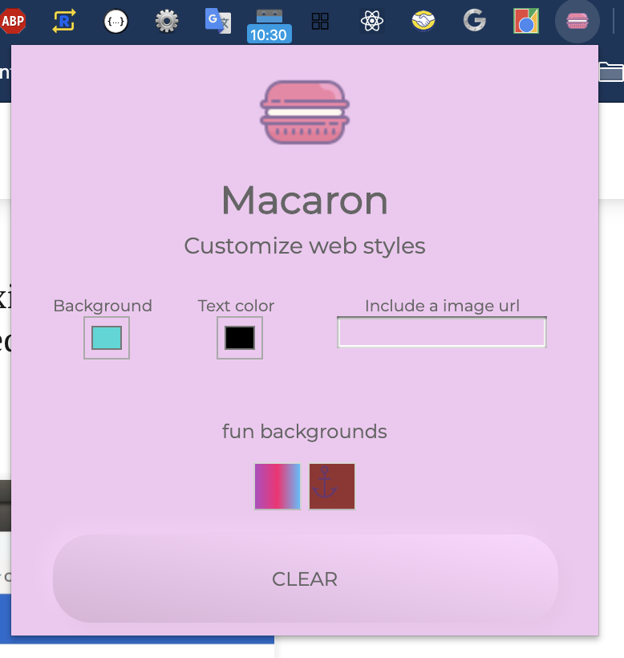

<h1 align="center">Welcome to Macaron Google extension 👋</h1>

  
  
  
  

A fun aplication for customize webs.

### 1. Clone this repo

   
### 2. Go to chrome://extensions/ Enable developer mode slide

  
   
   

### 3. Upload extension

  
  
    

### 4. Go to the location where you clone this repo

   
    
    
   
### 4. The extension will be installed now.

  
    
    
   

## Author

👤 **Guadalupe Jazmin Lazzo**

* Website: http://guadalazzo.github.io
* Twitter: [@luppelazzo](https://twitter.com/luppelazzo)
* Github: [@guadalazzo](https://github.com/guadalazzo)
* LinkedIn: [@https:\/\/www.linkedin.com\/in\/guadalupe-jazmin-lazzo\/](https://linkedin.com/in/https:\/\/www.linkedin.com\/in\/guadalupe-jazmin-lazzo\/)

## 🤝 Contributing

Contributions, issues and feature requests are welcome! Feel free to check [issues page](https://github.com/guadalazzo/pink-extension/issues). 

## Show your support

Give a ⭐️ if this project helped you!

## 📝 License

Copyright © 2020 [Guadalupe Jazmin Lazzo](https://github.com/guadalazzo). 

